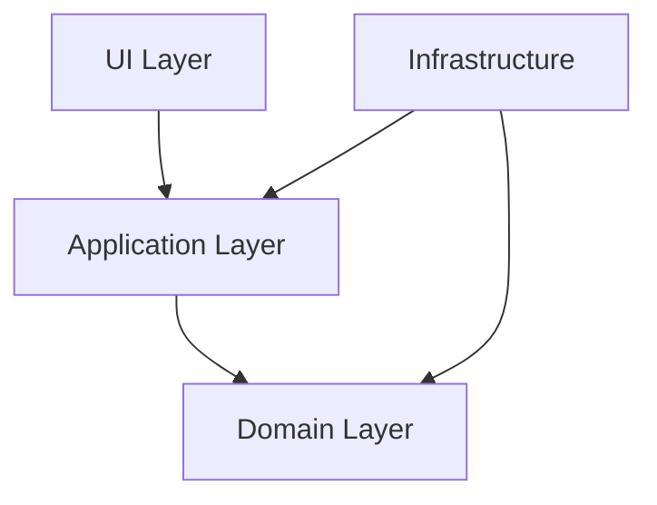

# Migración a Clean Architecture - Front-End-Phonetics

## 🎯 **Migración Completada**

Los componentes han sido migrados exitosamente de la arquitectura tradicional a **Clean Architecture** con **Vertical Slicing**.

---

## 📁 **Estructura Anterior vs Nueva**

### **❌ Estructura Anterior**
```
src/
├── components/          # Horizontal slicing
│   ├── AudioRecorder.tsx
│   └── AnalysisResults.tsx
├── hooks/
│   └── useAudioRecorder.ts
├── services/
│   └── phonemeAnalysis.ts
└── types/
    └── api.ts
```

### **✅ Nueva Estructura (Clean Architecture)**
```
src/
├── core/                    # Configuración global
│   ├── config/
│   ├── logging/
│   └── providers/
├── shared/                  # UI Kit y utilidades
│   ├── ui/                  # Design System
│   ├── hooks/               # Hooks reutilizables
│   └── utils/               # Utilidades
└── modules/                 # Vertical slicing por dominio
    └── phoneme-analysis/
        ├── domain/          # Entidades, casos de uso
        ├── infrastructure/  # Repositorios, adapters
        └── ui/             # Componentes, actions, hooks
```

---

## 🔄 **Componentes Migrados**

### **1. AudioRecorder → phoneme-analysis/ui/components/audio-recorder.tsx**
- ✅ Migrado a **módulo de dominio**
- ✅ Usa **Design System** (`@/shared/ui`)
- ✅ **Error Boundaries** granulares
- ✅ Mejor UX con loading states

### **2. AnalysisResults → phoneme-analysis/ui/components/analysis-results.tsx**
- ✅ Migrado a **módulo de dominio**
- ✅ Usa **Server Action results**
- ✅ Componentes del Design System
- ✅ Error handling mejorado

### **3. useAudioRecorder → shared/hooks/use-audio-recorder.ts**
- ✅ Movido a **shared/hooks**
- ✅ Marcado como `'use client'`
- ✅ Reutilizable en toda la app

### **4. Nueva Página Principal**
- ✅ **PhonemeAnalysisPage** - Componente contenedor
- ✅ Usa **Server Actions** en lugar de servicios
- ✅ **Error Boundaries** estratégicos
- ✅ **React Query** para estado servidor

---

## ⚡ **Mejoras Implementadas**

### **Server Actions vs API Routes**
```typescript
// ❌ ANTES: API Route + Service
const result = await PhonemeAnalysisService.analyzeAudio(audioBlob);

// ✅ AHORA: Server Action
const { analyzeAudio, isLoading, result } = usePhonemeAnalysis();
analyzeAudio(formData);
```

### **Design System Integrado**
```typescript
// ❌ ANTES: Clases CSS hardcodeadas
<button className="bg-blue-500 hover:bg-blue-600 text-white...">

// ✅ AHORA: Componentes reutilizables
<Button variant="default" loading={isLoading}>
```

### **Error Boundaries Granulares**
```typescript
// ✅ NUEVO: Error isolation
<ErrorBoundary level="page">
  <ErrorBoundary level="section">
    <AudioRecorder />
  </ErrorBoundary>
  <ErrorBoundary level="component">
    <AnalysisResults />
  </ErrorBoundary>
</ErrorBoundary>
```

---

## 🏗️ **Arquitectura Implementada**

### **Clean Architecture Layers**
1. **Domain Layer** - Entidades puras, casos de uso
2. **Infrastructure Layer** - Repositorios, adapters, DTOs
3. **UI Layer** - Componentes, hooks, actions

### **Dependency Rule**


### **Server Actions Pattern**
- ✅ Reemplaza API Routes para mutaciones
- ✅ Validación con **Zod**
- ✅ **Correlation IDs** automáticos
- ✅ **Error handling** estructurado

---

## 🎨 **Design System**

### **Componentes Disponibles**
- `Button` - Variantes, loading states
- `Card` - Layout consistente
- `Alert` - Mensajes de error/éxito
- `Skeleton` - Loading placeholders
- `ErrorBoundary` - Manejo de errores
- `Input` - Formularios

### **Uso**
```typescript
import { Button, Card, Alert } from '@/shared/ui';
```

---

## 🔧 **Hooks Migrados**

### **usePhonemeAnalysis**
```typescript
const { 
  analyzeAudio,    // Función para analizar
  isLoading,       // Estado de carga
  error,          // Errores del formulario
  result,         // Resultado del análisis
  reset          // Reset del estado
} = usePhonemeAnalysis();
```

### **useAudioRecorder** (Movido a shared)
```typescript
const {
  isRecording,
  audioBlob,
  startRecording,
  stopRecording
} = useAudioRecorder();
```

---

## 📋 **Próximos Pasos**

### **Implementados ✅**
- [x] Migrar AudioRecorder
- [x] Migrar AnalysisResults  
- [x] Crear Server Actions
- [x] Implementar Design System
- [x] Error Boundaries
- [x] Clean Architecture structure

### **Recomendados para el futuro 📝**
- [ ] Tests unitarios con Jest
- [ ] Tests de integración con MSW
- [ ] Storybook para Design System
- [ ] Performance optimization
- [ ] Accessibility improvements

---

## 🚀 **Comandos**

```bash
# Desarrollo
npm run dev

# Build production
npm run build

# Verificar tipos
npm run type-check

# Linting
npm run lint
```

---

## 📊 **Beneficios de la Migración**

- 🏗️ **Arquitectura escalable** - Clean Architecture + Vertical Slicing
- 🔒 **Seguridad mejorada** - JWT/JWE con jose, sessions encriptadas
- 🎨 **Design System** - Componentes reutilizables y consistentes
- 📱 **UX mejorada** - Error boundaries, loading states, mejor feedback
- 🔍 **Observabilidad** - Logging estructurado, correlation IDs
- ⚡ **Performance** - Server Actions, React Query, optimizaciones
- 🧪 **Testeable** - Separación clara de responsabilidades
- 📝 **Mantenible** - Código organizado por dominio, no por tipo técnico