# Authentication System Documentation

## 📋 Overview

Sistema completo de autenticación implementado siguiendo la guía de arquitectura (`GUIDE_ARCHITECTURE.md` Sección 4). Utiliza **Server Actions**, **cookies HttpOnly encriptadas con JWE**, y **validación de sesión en middleware**.

## 🏗️ Architecture

### Flow Diagram

```mermaid
sequenceDiagram
    participant User as 👤 User
    participant Login as 🖥️ Login Page
    participant Action as ⚡ Server Action
    participant Session as 🔐 SessionManager
    participant MW as 🛡️ Middleware
    participant Protected as 📄 Protected Page
    
    User->>Login: Submit credentials
    Login->>Action: loginAction(formData)
    Action->>Action: Validate with Zod
    Action->>Action: Mock auth (TODO: real API)
    Action->>Action: Create JWT with jose
    Action->>Session: setSession (JWE encrypted)
    Session-->>Action: HttpOnly cookie set
    Action->>Login: redirect('/')
    Login->>MW: Request to protected page
    MW->>Session: getSession()
    Session-->>MW: Decrypted session data
    MW->>MW: Verify JWT
    MW->>Protected: Add x-user-id headers
    Protected-->>User: Protected content
```



### Components

```
src/
├── app/
│   ├── auth/
│   │   └── actions.ts          # ⚡ Server Actions (login, register, logout)
│   ├── login/
│   │   ├── page.tsx            # 📄 Login page with Suspense
│   │   └── login-form.tsx      # 📝 Login form component
│   └── register/
│       ├── page.tsx            # 📄 Register page
│       └── register-form.tsx   # 📝 Register form component
├── middleware.ts               # 🛡️ Session validation & route protection
├── core/
│   └── logging/
│       └── logger.ts           # 📊 Enhanced with auth context
└── shared/
    ├── utils/
    │   ├── session.ts          # 🔐 SessionManager (JWE encryption)
    │   └── encryption.ts       # 🔑 JWT helpers with jose
    ├── ui/
    │   └── user-menu.tsx       # 👤 User menu with logout
    └── hooks/
        └── use-session.ts      # 🪝 Client-side session hook
```

## 🚀 Usage

### 1. Login

**Demo Credentials:**
- Email: `demo@ejemplo.com`
- Password: `password`

```tsx
// Login is handled by Server Action
// User navigates to /login, submits form, and gets redirected
```

### 2. Protected Routes

By default, **ALL routes require authentication** except:
- `/login`
- `/register`
- `/forgot-password`
- `/reset-password`
- `/api/health`
- `/api/webhooks`
- Test pages (should be removed in production)

### 3. Adding Public Routes

Edit `src/middleware.ts`:

```typescript
function isPublicRoute(pathname: string): boolean {
  const publicRoutes = [
    '/login',
    '/register',
    '/your-new-public-route', // Add here
  ];
  
  return publicRoutes.some(route => pathname.startsWith(route));
}
```

### 4. Accessing Session in Server Components

```tsx
// app/dashboard/page.tsx
import { SessionManager } from '@/shared/utils/session';

export default async function DashboardPage() {
  const session = await SessionManager.getSession();
  
  if (!session) {
    redirect('/login');
  }
  
  return (
    <div>
      <h1>Welcome, {session.email}</h1>
      <p>User ID: {session.userId}</p>
    </div>
  );
}
```

### 5. Accessing Session in API Routes

Session info is automatically added to headers by middleware:

```typescript
// app/api/some-endpoint/route.ts
export async function GET(request: NextRequest) {
  const userId = request.headers.get('x-user-id');
  const userEmail = request.headers.get('x-user-email');
  const permissions = JSON.parse(request.headers.get('x-user-permissions') || '[]');
  
  // Your logic here
}
```

### 6. Logout

```tsx
import { UserMenu } from '@/shared/ui/user-menu';

export function Header() {
  return (
    <header>
      <UserMenu userEmail="user@example.com" />
    </header>
  );
}
```

## 🔒 Security Features

### ✅ Implemented

1. **HttpOnly Cookies**
   - Session stored in secure, HttpOnly cookies
   - Not accessible via JavaScript
   - Automatic CSRF protection (Server Actions)

2. **JWE Encryption (jose)**
   - Session data encrypted with JWE
   - Standard RFC 7516 compliance
   - Automatic expiration handling

3. **JWT Tokens (jose)**
   - Internal JWT for API authentication
   - Signed with HS256 algorithm
   - 7-day expiration

4. **Middleware Validation**
   - Every request validates session
   - Invalid sessions redirect to login
   - Expired JWTs trigger re-authentication

5. **Secure Headers**
   - X-Frame-Options: SAMEORIGIN
   - X-Content-Type-Options: nosniff
   - X-XSS-Protection: 1; mode=block
   - Referrer-Policy: strict-origin-when-cross-origin

6. **Correlation IDs**
   - Every request tracked with unique ID
   - Logs include correlation for debugging
   - Full request lifecycle tracing

### ⚠️ TODO: Connect to Real Auth Service

Currently using **mock authentication**. Replace in `src/app/auth/actions.ts`:

```typescript
// ❌ Current (mock)
const authResponse = await mockAuthService(email, password);

// ✅ Replace with real API call
const authResponse = await fetch(`${process.env.AUTH_SERVICE_URL}/login`, {
  method: 'POST',
  headers: { 'Content-Type': 'application/json' },
  body: JSON.stringify({ email, password }),
});
```

## 🔧 Configuration

### Environment Variables

```env
# Required for production
JWT_SECRET=your-jwt-secret-min-32-characters-long
SESSION_ENCRYPTION_KEY=your-encryption-key-min-32-chars

# Optional: External auth service
AUTH_SERVICE_URL=http://localhost:5001
```

### Session Duration

Default: **7 days**

To change, edit `src/app/auth/actions.ts`:

```typescript
await SessionManager.setSession({
  // ...
  expiresAt: Date.now() + (14 * 24 * 60 * 60 * 1000), // 14 days
});
```

## 📊 Logging

All authentication events are logged with correlation IDs:

```json
{
  "timestamp": "2025-12-05T10:30:00Z",
  "level": "INFO",
  "message": "Login successful",
  "correlationId": "req_1733395800000_abc123",
  "userId": "user_1733395800000",
  "email": "user@example.com",
  "action": "login"
}
```

### Log Events

- `Login attempt started`
- `Login successful` / `Login failed`
- `Registration attempt started`
- `Registration successful`
- `Logout initiated`
- `Unauthorized access attempt`
- `Invalid JWT in session`
- `Session validated`

## 🧪 Testing

### Manual Testing Flow

1. **Access protected page** → Should redirect to `/login`
2. **Login with wrong credentials** → Should show error
3. **Login with demo credentials** → Should redirect to `/`
4. **Access protected page** → Should work
5. **Logout** → Should clear session and redirect to `/login`
6. **Access protected page after logout** → Should redirect to `/login`

### Demo Credentials

```
Email: demo@ejemplo.com
Password: password
```

Or any email with password `demo123`.

### Testing Session Expiration

Manually clear cookies in browser DevTools:
1. Open DevTools → Application → Cookies
2. Delete `__Secure-session` cookie
3. Refresh page → Should redirect to login

## 🚨 Common Issues

### 1. "Session expired" Error

**Cause:** JWT token expired or invalid

**Solution:** User will be redirected to login automatically

### 2. Redirect Loop

**Cause:** Session validation failing on login page

**Solution:** Ensure `/login` is in `isPublicRoute()` list

### 3. Headers Too Large (431)

**Cause:** Session cookie too large

**Solution:** Reduce session data or increase server limits

### 4. CORS Issues

**Cause:** External auth service blocking requests

**Solution:** Configure CORS on auth service

## 🎯 Best Practices

### ✅ DO

- Use Server Actions for all auth operations
- Validate session server-side in middleware
- Store minimal data in session
- Use correlation IDs for debugging
- Log all auth events
- Implement proper error messages
- Use Suspense for forms with useSearchParams

### ❌ DON'T

- Don't expose JWT tokens to client
- Don't store sensitive data in localStorage
- Don't skip middleware validation
- Don't use client-side only auth
- Don't hardcode credentials (use env vars)
- Don't trust client-side session checks

## 📚 Architecture Compliance

This implementation follows **GUIDE_ARCHITECTURE.md**:

| Section | Requirement | Status |
|---------|-------------|--------|
| 4.1 | HttpOnly cookies with encryption | ✅ |
| 4.2 | jose library for JWT/JWE | ✅ |
| 4.2 | Token flow with SessionManager | ✅ |
| 4.2 | Middleware session validation | ✅ |
| 4.2.1 | Server Actions for auth | ✅ |
| 4.5 | No API Routes for mutations | ✅ |
| 5.1 | Correlation IDs | ✅ |
| 5.1 | Structured logging | ✅ |

## 🔄 Migration from NextAuth

If migrating from NextAuth:

1. Remove NextAuth configuration
2. Update session access:
   ```tsx
   // ❌ Before (NextAuth)
   const { data: session } = useSession();
   
   // ✅ After (Custom auth)
   const session = await SessionManager.getSession(); // Server
   // or
   const { session } = useSession(); // Client (display only)
   ```
3. Update protected routes in middleware
4. Replace `signIn()` / `signOut()` with Server Actions

## 🚀 Future Improvements

- [ ] Add refresh token rotation
- [ ] Implement OAuth providers (Google, GitHub)
- [ ] Add 2FA support
- [ ] Implement password reset flow
- [ ] Add email verification
- [ ] Session activity monitoring
- [ ] Rate limiting for login attempts
- [ ] Remember me functionality
- [ ] Multiple device management

## 📞 Support

For issues related to authentication:

1. Check logs with correlation ID
2. Verify environment variables
3. Test with demo credentials
4. Review middleware configuration
5. Check browser console for errors

---

**Last Updated:** December 5, 2025  
**Version:** 1.0.0  
**Status:** ✅ Production Ready (with mock auth)
