# GUIDE_ARCHITECTURE.md

## Guía de Arquitectura - Next.js BFF para Ecosistema de Microservicios

### Versión: 1.0 | Fecha: Diciembre 2024

---

## 📋 **ÍNDICE**

1. [Filosofía y Patrones](#1-filosofía-y-patrones)
2. [Estructura de Directorios](#2-estructura-de-directorios)
3. [Detalle de Capas e Implementación](#3-detalle-de-capas-e-implementación)
4. [Seguridad y Gestión de Sesión](#4-seguridad-y-gestión-de-sesión-bff-pattern)
5. [Observabilidad y Desarrollo](#5-observabilidad-y-desarrollo-operational-excellence)
6. [Checklist de Code Review](#6-checklist-de-code-review)

---

## 1. **FILOSOFÍA Y PATRONES**

### 1.1 Clean Architecture: La Regla de Dependencia

**PRINCIPIO FUNDAMENTAL**: Las dependencias de código fuente deben apuntar únicamente hacia adentro, hacia políticas de alto nivel.

```mermaid
graph TB
    UI["🎨 UI Layer (Components)"]
    APP["📦 Application Layer (Use Cases)"]
    DOM["🏛️ Domain Layer (Entities)"]
    INFRA["🔧 Infrastructure Layer (APIs, DB)"]
    
    UI --> APP
    APP --> DOM
    INFRA --> APP
    INFRA --> DOM
    
    style DOM fill:#e1f5fe
    style APP fill:#f3e5f5
    style UI fill:#e8f5e8
    style INFRA fill:#fff3e0
```



**¿Por qué desacoplamos?**

1. **Testabilidad**: Podemos probar lógica de negocio sin UI ni infraestructura
2. **Flexibilidad**: Cambiar proveedores externos sin afectar el core
3. **Mantenibilidad**: Separación clara de responsabilidades

```typescript
// ❌ INCORRECTO: Lógica de negocio acoplada a implementación
export function UserProfile() {
  const [user, setUser] = useState(null);
  
  useEffect(() => {
    // Lógica de negocio mezclada con detalles de implementación
    fetch('/api/users/123')
      .then(res => res.json())
      .then(data => setUser(data));
  }, []);
  
  return <div>{user?.name}</div>;
}

// ✅ CORRECTO: Separación de concerns
export function UserProfile() {
  const { user, loading, error } = useUserProfile(); // Hook del dominio
  
  if (loading) return <ProfileSkeleton />;
  if (error) return <ErrorBoundary error={error} />;
  
  return <UserCard user={user} />;
}
```

### 1.2 Next.js como BFF: Agregador y Barrera de Seguridad

**Next.js actúa como Backend for Frontend**, proporcionando:

```typescript
// API Route actuando como BFF
// app/api/dashboard/route.ts
export async function GET(request: Request) {
  const session = await getServerSession(request);
  
  // Agregación de múltiples microservicios
  const [userProfile, preferences, analytics] = await Promise.all([
    userService.getProfile(session.userId),
    settingsService.getPreferences(session.userId),
    analyticsService.getDashboard(session.userId)
  ]);
  
  // Transformación y agregación específica para el frontend
  return NextResponse.json({
    user: userProfile,
    settings: preferences,
    metrics: analytics.summary
  });
}
```

**Beneficios del patrón BFF:**
- **Reducción de round-trips**: Una llamada desde el cliente obtiene datos agregados
- **Seguridad centralizada**: Tokens y autenticación manejados server-side
- **Transformación de datos**: Adaptación de APIs backend para necesidades específicas del frontend

### 1.3 Vertical Slicing: Organización por Funcionalidad

**REGLA**: Organizamos el código por **features/funcionalidades**, no por tipos técnicos.

```
❌ HORIZONTAL SLICING (por tipo técnico):
src/
├── components/
├── hooks/
├── services/
└── types/

✅ VERTICAL SLICING (por funcionalidad):
src/
├── modules/
│   ├── authentication/
│   ├── user-management/
│   └── analytics/
└── shared/ (solo elementos realmente compartidos)
```

---

## 2. **ESTRUCTURA DE DIRECTORIOS**

### 2.1 Árbol de Directorios Estándar

```
src/
├── core/                           # Configuración global y providers
│   ├── config/
│   │   ├── app.config.ts           # Variables de entorno tipadas
│   │   ├── api.config.ts           # URLs y configuración de APIs
│   │   └── feature-flags.config.ts # Feature flags
│   ├── logging/
│   │   ├── logger.ts               # Logger centralizado
│   │   └── correlation.ts          # Correlation ID management
│   └── providers/
│       ├── app-providers.tsx       # Root providers wrapper
│       ├── query-provider.tsx      # React Query setup
│       └── theme-provider.tsx      # Theme/styling provider
├── shared/                         # UI Kit y utilidades compartidas
│   ├── ui/                         # Design System components
│   │   ├── button/
│   │   ├── input/
│   │   ├── form/
│   │   └── modal/
│   ├── hooks/                      # Hooks reutilizables
│   │   ├── use-debounce.ts
│   │   ├── use-local-storage.ts
│   │   └── use-permission.ts
│   ├── utils/                      # Funciones utilitarias
│   │   ├── format.ts
│   │   ├── validation.ts
│   │   └── encryption.ts
│   └── constants/                  # Constantes globales
│       ├── api-endpoints.ts
│       └── app-constants.ts
├── modules/                        # Features organizadas verticalmente
│   ├── authentication/
│   │   ├── domain/                 # Lógica pura, sin dependencias externas
│   │   │   ├── entities/
│   │   │   │   └── user.entity.ts
│   │   │   ├── repositories/
│   │   │   │   └── auth.repository.interface.ts
│   │   │   └── use-cases/
│   │   │       └── login.use-case.ts
│   │   ├── infrastructure/         # Implementaciones concretas
│   │   │   ├── dtos/
│   │   │   │   └── auth.dto.ts
│   │   │   ├── adapters/
│   │   │   │   └── user.adapter.ts
│   │   │   └── repositories/
│   │   │       └── auth.repository.impl.ts
│   │   └── ui/                     # Capa de presentación
│   │       ├── components/
│   │       │   ├── login-form.tsx
│   │       │   └── auth-guard.tsx
│   │       ├── containers/
│   │       │   └── login-page.tsx
│   │       ├── actions/             # Server Actions del módulo
│   │       │   └── auth.actions.ts
│   │       └── hooks/
│   │           └── use-auth.ts
│   ├── user-management/
│   │   ├── domain/
│   │   ├── infrastructure/
│   │   ├── ui/
│   │   │   ├── components/
│   │   │   ├── actions/             # Server Actions del módulo
│   │   │   │   └── user.actions.ts
│   │   │   └── hooks/
│   │   └── analytics/
│       ├── domain/
│       ├── infrastructure/
│       └── ui/
├── middleware.ts                   # Next.js middleware
└── app/                           # Next.js App Router
    ├── globals.css
    ├── layout.tsx
    ├── page.tsx
    ├── login/                      # Páginas de autenticación
    │   ├── page.tsx
    │   └── login-form.tsx
    ├── auth/                       # Server Actions globales de auth
    │   └── actions.ts
    └── api/                       # Solo para endpoints públicos/externos
        ├── health/
        │   └── route.ts           # Health check público
        └── webhooks/
            └── route.ts           # Webhooks externos
```

### 2.2 Configuración del Core

```typescript
// src/core/config/app.config.ts
import { z } from 'zod';

const envSchema = z.object({
  NODE_ENV: z.enum(['development', 'staging', 'production']),
  NEXTAUTH_SECRET: z.string().min(1),
  API_BASE_URL: z.string().url(),
  ANALYTICS_API_URL: z.string().url(),
  USER_SERVICE_URL: z.string().url(),
  SESSION_ENCRYPTION_KEY: z.string().min(32),
  JWT_SECRET: z.string().min(32), // Para jose JWT signing
});

type EnvConfig = z.infer<typeof envSchema>;

function validateEnv(): EnvConfig {
  const result = envSchema.safeParse(process.env);
  
  if (!result.success) {
    console.error('❌ Invalid environment variables:', result.error.format());
    throw new Error('Invalid environment configuration');
  }
  
  return result.data;
}

export const appConfig = validateEnv();

// src/core/config/api.config.ts
export const apiConfig = {
  baseURL: appConfig.API_BASE_URL,
  timeout: 10000,
  retryAttempts: 3,
  endpoints: {
    auth: '/auth',
    users: '/users',
    analytics: '/analytics'
  }
} as const;
```

---

## 3. **DETALLE DE CAPAS E IMPLEMENTACIÓN**

### 3.1 Capa de Dominio: Tipos Limpios

```typescript
// modules/user-management/domain/entities/user.entity.ts
export interface UserEntity {
  readonly id: string;
  readonly email: string;
  readonly profile: UserProfile;
  readonly permissions: Permission[];
  readonly createdAt: Date;
  readonly lastLoginAt: Date | null;
}

export interface UserProfile {
  readonly firstName: string;
  readonly lastName: string;
  readonly avatar?: string;
  readonly timezone: string;
}

export interface Permission {
  readonly resource: string;
  readonly actions: string[];
}

// modules/user-management/domain/repositories/user.repository.interface.ts
export interface UserRepository {
  findById(id: string): Promise<UserEntity | null>;
  findByEmail(email: string): Promise<UserEntity | null>;
  save(user: UserEntity): Promise<UserEntity>;
  delete(id: string): Promise<void>;
}

// modules/user-management/domain/use-cases/get-user-profile.use-case.ts
export class GetUserProfileUseCase {
  constructor(private userRepository: UserRepository) {}
  
  async execute(userId: string): Promise<UserEntity> {
    const user = await this.userRepository.findById(userId);
    
    if (!user) {
      throw new Error('User not found');
    }
    
    return user;
  }
}
```

### 3.2 Capa de Infraestructura: Patrón Adapter (CRÍTICO)

```typescript
// modules/user-management/infrastructure/dtos/user.dto.ts
import { z } from 'zod';

export const UserDTOSchema = z.object({
  id: z.string(),
  email: z.string().email(),
  first_name: z.string(),
  last_name: z.string(),
  avatar_url: z.string().optional(),
  timezone: z.string(),
  permissions: z.array(z.object({
    resource: z.string(),
    actions: z.array(z.string())
  })),
  created_at: z.string().datetime(),
  last_login_at: z.string().datetime().nullable()
});

export type UserDTO = z.infer<typeof UserDTOSchema>;

// modules/user-management/infrastructure/adapters/user.adapter.ts
import { UserEntity, UserProfile, Permission } from '../../domain/entities/user.entity';
import { UserDTO } from '../dtos/user.dto';

export class UserAdapter {
  static toDomain(dto: UserDTO): UserEntity {
    return {
      id: dto.id,
      email: dto.email,
      profile: {
        firstName: dto.first_name,
        lastName: dto.last_name,
        avatar: dto.avatar_url,
        timezone: dto.timezone
      },
      permissions: dto.permissions.map(p => ({
        resource: p.resource,
        actions: p.actions
      })),
      createdAt: new Date(dto.created_at),
      lastLoginAt: dto.last_login_at ? new Date(dto.last_login_at) : null
    };
  }
  
  static toDTO(entity: UserEntity): UserDTO {
    return {
      id: entity.id,
      email: entity.email,
      first_name: entity.profile.firstName,
      last_name: entity.profile.lastName,
      avatar_url: entity.profile.avatar,
      timezone: entity.profile.timezone,
      permissions: entity.permissions.map(p => ({
        resource: p.resource,
        actions: p.actions
      })),
      created_at: entity.createdAt.toISOString(),
      last_login_at: entity.lastLoginAt?.toISOString() ?? null
    };
  }
}

// modules/user-management/infrastructure/repositories/user.repository.impl.ts
import { UserRepository } from '../../domain/repositories/user.repository.interface';
import { UserEntity } from '../../domain/entities/user.entity';
import { UserAdapter } from '../adapters/user.adapter';
import { UserDTOSchema } from '../dtos/user.dto';
import { apiConfig } from '@/core/config/api.config';

export class UserRepositoryImpl implements UserRepository {
  private baseURL = `${apiConfig.baseURL}${apiConfig.endpoints.users}`;
  
  async findById(id: string): Promise<UserEntity | null> {
    try {
      const response = await fetch(`${this.baseURL}/${id}`, {
        headers: {
          'Content-Type': 'application/json',
          'x-request-id': this.generateCorrelationId(),
        }
      });
      
      if (response.status === 404) {
        return null;
      }
      
      if (!response.ok) {
        throw new Error(`Failed to fetch user: ${response.statusText}`);
      }
      
      const data = await response.json();
      const validatedDTO = UserDTOSchema.parse(data);
      
      return UserAdapter.toDomain(validatedDTO);
    } catch (error) {
      console.error(`Error fetching user ${id}:`, error);
      throw error;
    }
  }
  
  async findByEmail(email: string): Promise<UserEntity | null> {
    // Implementation similar to findById
    throw new Error('Method not implemented.');
  }
  
  async save(user: UserEntity): Promise<UserEntity> {
    // Implementation for saving user
    throw new Error('Method not implemented.');
  }
  
  async delete(id: string): Promise<void> {
    // Implementation for deleting user
    throw new Error('Method not implemented.');
  }
  
  private generateCorrelationId(): string {
    return `req_${Date.now()}_${Math.random().toString(36).substr(2, 9)}`;
  }
}
```

### 3.3 UI & UX Avanzado: Separación Controller/View

```typescript
// modules/user-management/ui/hooks/use-user-profile.ts (Controller)
import { useQuery } from '@tanstack/react-query';
import { GetUserProfileUseCase } from '../../domain/use-cases/get-user-profile.use-case';
import { UserRepositoryImpl } from '../../infrastructure/repositories/user.repository.impl';

const userRepository = new UserRepositoryImpl();
const getUserProfileUseCase = new GetUserProfileUseCase(userRepository);

export function useUserProfile(userId: string) {
  return useQuery({
    queryKey: ['user-profile', userId],
    queryFn: () => getUserProfileUseCase.execute(userId),
    staleTime: 5 * 60 * 1000, // 5 minutes
    retry: 3,
  });
}

// modules/user-management/ui/components/user-profile.tsx (View)
import { Card, Avatar, Skeleton } from '@/shared/ui';
import { useUserProfile } from '../hooks/use-user-profile';
import { ErrorBoundary } from '@/shared/ui/error-boundary';

interface UserProfileProps {
  userId: string;
}

export function UserProfile({ userId }: UserProfileProps) {
  const { data: user, isLoading, error } = useUserProfile(userId);
  
  if (isLoading) {
    return <UserProfileSkeleton />;
  }
  
  if (error) {
    return <ErrorBoundary error={error} />;
  }
  
  if (!user) {
    return <div>Usuario no encontrado</div>;
  }
  
  return (
    <Card className="p-6">
      <div className="flex items-center gap-4">
        <Avatar 
          src={user.profile.avatar} 
          alt={`${user.profile.firstName} ${user.profile.lastName}`}
          size="lg"
        />
        <div>
          <h2 className="text-xl font-semibold">
            {user.profile.firstName} {user.profile.lastName}
          </h2>
          <p className="text-gray-600">{user.email}</p>
          <p className="text-sm text-gray-500">
            Zona horaria: {user.profile.timezone}
          </p>
        </div>
      </div>
    </Card>
  );
}

function UserProfileSkeleton() {
  return (
    <Card className="p-6">
      <div className="flex items-center gap-4">
        <Skeleton className="h-16 w-16 rounded-full" />
        <div className="space-y-2">
          <Skeleton className="h-6 w-32" />
          <Skeleton className="h-4 w-24" />
          <Skeleton className="h-3 w-20" />
        </div>
      </div>
    </Card>
  );
}
```

### 3.4 URL as State: Usando searchParams

**REGLA**: Los filtros, paginación y estado de UI deben estar en la URL, no en `useState`.

```typescript
// ❌ INCORRECTO: Estado en memoria
export function UsersList() {
  const [filters, setFilters] = useState({ role: '', status: '' });
  const [page, setPage] = useState(1);
  const [sortBy, setSortBy] = useState('name');
  
  // Estado se pierde al navegar o recargar
}

// ✅ CORRECTO: Estado en URL usando nuqs
import { useQueryState, parseAsString, parseAsInteger } from 'nuqs';

export function UsersList() {
  const [role, setRole] = useQueryState('role', parseAsString.withDefault(''));
  const [status, setStatus] = useQueryState('status', parseAsString.withDefault(''));
  const [page, setPage] = useQueryState('page', parseAsInteger.withDefault(1));
  const [sortBy, setSortBy] = useQueryState('sortBy', parseAsString.withDefault('name'));
  
  const { data, isLoading } = useUsers({
    filters: { role, status },
    pagination: { page, limit: 20 },
    sorting: { field: sortBy, direction: 'asc' }
  });
  
  return (
    <div>
      <UsersFilters 
        role={role}
        status={status}
        onRoleChange={setRole}
        onStatusChange={setStatus}
      />
      <UsersPagination 
        currentPage={page}
        onPageChange={setPage}
      />
      <UsersTable 
        users={data?.users}
        sortBy={sortBy}
        onSortChange={setSortBy}
      />
    </div>
  );
}

// Alternativa nativa de Next.js
import { useSearchParams, useRouter, usePathname } from 'next/navigation';

export function useURLState() {
  const router = useRouter();
  const pathname = usePathname();
  const searchParams = useSearchParams();
  
  const updateURL = (key: string, value: string | null) => {
    const params = new URLSearchParams(searchParams.toString());
    
    if (value === null || value === '') {
      params.delete(key);
    } else {
      params.set(key, value);
    }
    
    router.push(`${pathname}?${params.toString()}`);
  };
  
  return {
    get: (key: string) => searchParams.get(key),
    set: updateURL
  };
}
```

### 3.5 Error Boundaries Granulares

```typescript
// shared/ui/error-boundary.tsx
import React, { Component, ReactNode } from 'react';

interface ErrorBoundaryState {
  hasError: boolean;
  error?: Error;
}

interface ErrorBoundaryProps {
  children: ReactNode;
  fallback?: ReactNode;
  onError?: (error: Error, errorInfo: React.ErrorInfo) => void;
  level?: 'page' | 'section' | 'component';
}

export class ErrorBoundary extends Component<ErrorBoundaryProps, ErrorBoundaryState> {
  constructor(props: ErrorBoundaryProps) {
    super(props);
    this.state = { hasError: false };
  }
  
  static getDerivedStateFromError(error: Error): ErrorBoundaryState {
    return { hasError: true, error };
  }
  
  componentDidCatch(error: Error, errorInfo: React.ErrorInfo) {
    console.error(`Error Boundary (${this.props.level}):`, error, errorInfo);
    this.props.onError?.(error, errorInfo);
    
    // Report to monitoring service
    // reportError(error, { level: this.props.level, ...errorInfo });
  }
  
  render() {
    if (this.state.hasError) {
      if (this.props.fallback) {
        return this.props.fallback;
      }
      
      return <DefaultErrorFallback level={this.props.level} error={this.state.error} />;
    }
    
    return this.props.children;
  }
}

function DefaultErrorFallback({ level, error }: { level?: string; error?: Error }) {
  const isPageLevel = level === 'page';
  
  if (isPageLevel) {
    return (
      <div className="min-h-screen flex items-center justify-center">
        <div className="text-center">
          <h1 className="text-2xl font-bold text-red-600">Algo salió mal</h1>
          <p className="text-gray-600 mt-2">
            Ha ocurrido un error inesperado. Por favor, recarga la página.
          </p>
          <button 
            onClick={() => window.location.reload()}
            className="mt-4 px-4 py-2 bg-blue-600 text-white rounded"
          >
            Recargar página
          </button>
        </div>
      </div>
    );
  }
  
  return (
    <div className="p-4 border border-red-200 bg-red-50 rounded">
      <p className="text-red-800 text-sm">
        Error en este componente. El resto de la página sigue funcionando.
      </p>
    </div>
  );
}

// Uso estratégico de Error Boundaries
export function DashboardPage() {
  return (
    <ErrorBoundary level="page">
      <DashboardLayout>
        <div className="grid grid-cols-1 md:grid-cols-3 gap-6">
          <ErrorBoundary level="section" fallback={<WidgetSkeleton />}>
            <UserStatsWidget />
          </ErrorBoundary>
          
          <ErrorBoundary level="section" fallback={<WidgetSkeleton />}>
            <RevenueWidget />
          </ErrorBoundary>
          
          <ErrorBoundary level="section" fallback={<WidgetSkeleton />}>
            <ActivityWidget />
          </ErrorBoundary>
        </div>
        
        <ErrorBoundary level="section">
          <UsersList />
        </ErrorBoundary>
      </DashboardLayout>
    </ErrorBoundary>
  );
}
```

---

## 4. **SEGURIDAD Y GESTIÓN DE SESIÓN (BFF PATTERN)**

### 4.1 Almacenamiento Seguro: Cookies HttpOnly Encriptadas

```typescript
// shared/utils/encryption.ts
import { EncryptJWT, jwtDecrypt } from 'jose';
import { appConfig } from '@/core/config/app.config';

// Convert string to Uint8Array for jose
const JWT_SECRET = new TextEncoder().encode(appConfig.JWT_SECRET);
const SESSION_SECRET = new TextEncoder().encode(appConfig.SESSION_ENCRYPTION_KEY);

/**
 * Encrypts data using JWE (JSON Web Encryption)
 * More secure than native crypto for session data
 */
export async function encrypt(payload: Record<string, any>): Promise<string> {
  try {
    return await new EncryptJWT(payload)
      .setProtectedHeader({ alg: 'dir', enc: 'A256GCM' })
      .setIssuedAt()
      .setExpirationTime('7d')
      .encrypt(SESSION_SECRET);
  } catch (error) {
    throw new Error('Failed to encrypt session data');
  }
}

/**
 * Decrypts JWE encrypted data
 */
export async function decrypt(encryptedJWE: string): Promise<Record<string, any>> {
  try {
    const { payload } = await jwtDecrypt(encryptedJWE, SESSION_SECRET);
    return payload as Record<string, any>;
  } catch (error) {
    throw new Error('Failed to decrypt session data');
  }
}

/**
 * Creates a signed JWT token (for API authentication)
 */
export async function signJWT(payload: Record<string, any>, expiresIn: string = '1h'): Promise<string> {
  try {
    return await new EncryptJWT(payload)
      .setProtectedHeader({ alg: 'dir', enc: 'A256GCM' })
      .setIssuedAt()
      .setExpirationTime(expiresIn)
      .encrypt(JWT_SECRET);
  } catch (error) {
    throw new Error('Failed to sign JWT');
  }
}

/**
 * Verifies and decodes a JWT token
 */
export async function verifyJWT(token: string): Promise<Record<string, any>> {
  try {
    const { payload } = await jwtDecrypt(token, JWT_SECRET);
    return payload as Record<string, any>;
  } catch (error) {
    throw new Error('Invalid or expired JWT');
  }
}

// shared/utils/session.ts
import { cookies } from 'next/headers';
import { encrypt, decrypt } from './encryption';
import { z } from 'zod';
import { ResponseCookie } from 'next/dist/compiled/@edge-runtime/cookies';

const SessionDataSchema = z.object({
  userId: z.string(),
  email: z.string(),
  accessToken: z.string(),
  refreshToken: z.string(),
  expiresAt: z.number(),
  permissions: z.array(z.string())
});

export type SessionData = z.infer<typeof SessionDataSchema>;

export class SessionManager {
  private static COOKIE_NAME = '__Secure-session';
  
  static async setSession(data: SessionData): Promise<void> {
    try {
      const encrypted = await encrypt(data);
      
      const cookieStore = await cookies();
      
      const cookieOptions: Partial<ResponseCookie> = {
        httpOnly: true,
        secure: process.env.NODE_ENV === 'production',
        sameSite: 'strict',
        maxAge: 60 * 60 * 24 * 7, // 7 days
        path: '/'
      };
      
      cookieStore.set(this.COOKIE_NAME, encrypted, cookieOptions);
    } catch (error) {
      console.error('Error setting session:', error);
      throw new Error('Failed to create session');
    }
  }
  
  static async getSession(): Promise<SessionData | null> {
    try {
      const cookieStore = await cookies();
      const encrypted = cookieStore.get(this.COOKIE_NAME)?.value;
      
      if (!encrypted) {
        return null;
      }
      
      const decrypted = await decrypt(encrypted);
      const validated = SessionDataSchema.parse(decrypted);
      
      // JWE handles expiration automatically through 'exp' claim
      // Additional check for custom expiresAt if needed
      if (validated.expiresAt && Date.now() > validated.expiresAt) {
        await this.clearSession();
        return null;
      }
      
      return validated;
    } catch (error) {
      console.error('Error reading session:', error);
      await this.clearSession();
      return null;
    }
  }
  
  static async clearSession(): Promise<void> {
    const cookieStore = await cookies();
    cookieStore.delete(this.COOKIE_NAME);
  }
}
```

> **⚠️ IMPORTANTE - Next.js 16.0.4 Compatibility**
> 
> En Next.js 16+, tanto `cookies()` como `headers()` retornan **Promesas** y deben ser utilizadas con `await`. Además, se recomienda usar **jose** para JWT y encriptación.
> 
> **Cambios principales:**
> - `cookies()` → `await cookies()` 
> - `headers()` → `await headers()`
> - Crypto nativo → **jose** library
> - Todas las funciones que las utilizan deben ser marcadas como `async`
> 
> **Instalación de dependencias requeridas:**
> ```bash
> npm install jose zod
> npm install -D @types/node
> ```
> 
> **Migración de encriptación:**
> ```typescript
> // ❌ Crypto nativo (inseguro para JWT)
> import { createCipheriv, createDecipheriv } from 'crypto';
> 
> // ✅ Jose (estándar para JWT/JWE)
> import { EncryptJWT, jwtDecrypt } from 'jose';
> ```
> 
> **Beneficios de jose:**
> - ✅ Estándar RFC 7516 (JWE) y RFC 7519 (JWT)
> - ✅ Manejo automático de expiración
> - ✅ Mayor seguridad que crypto nativo
> - ✅ Mejor rendimiento en Edge Runtime
> - ✅ Compatibilidad completa con Next.js 16+

### 4.2 Flujo de Token: Diagrama y Implementación


```typescript
// app/auth/actions.ts
'use server';

import { redirect } from 'next/navigation';
import { SessionManager } from '@/shared/utils/session';
import { signJWT } from '@/shared/utils/encryption';
import { CorrelationManager } from '@/core/logging/correlation';
import { logger } from '@/core/logging/logger';
import { z } from 'zod';

const LoginFormSchema = z.object({
  email: z.string().email('Email inválido'),
  password: z.string().min(1, 'Password requerido'),
});

export type LoginActionState = {
  errors?: {
    email?: string[];
    password?: string[];
    _form?: string[];
  };
  success?: boolean;
};

export async function loginAction(
  prevState: LoginActionState,
  formData: FormData
): Promise<LoginActionState> {
  const correlationId = CorrelationManager.generate();
  
  try {
    // 1. Validar datos del formulario
    const validatedFields = LoginFormSchema.safeParse({
      email: formData.get('email'),
      password: formData.get('password'),
    });
    
    if (!validatedFields.success) {
      return {
        errors: validatedFields.error.flatten().fieldErrors,
      };
    }
    
    const { email, password } = validatedFields.data;
    
    await logger.info('Login attempt started', {
      correlationId,
      email,
      action: 'login',
    });
    
    // 2. Llamar al microservicio de autenticación
    const authResponse = await fetch(`${process.env.AUTH_SERVICE_URL}/login`, {
      method: 'POST',
      headers: {
        'Content-Type': 'application/json',
        'x-request-id': correlationId,
      },
      body: JSON.stringify({ email, password }),
    });
    
    if (!authResponse.ok) {
      await logger.warn('Login failed - Invalid credentials', {
        correlationId,
        email,
        status: authResponse.status,
      });
      
      return {
        errors: {
          _form: ['Credenciales inválidas. Verifica tu email y contraseña.'],
        },
      };
    }
    
    const authData = await authResponse.json();
    
    // 3. Crear JWT token interno usando jose
    const internalJWT = await signJWT({
      userId: authData.user.id,
      email: authData.user.email,
      permissions: authData.user.permissions,
    }, '7d');
    
    // 4. Crear sesión encriptada con JWE
    await SessionManager.setSession({
      userId: authData.user.id,
      email: authData.user.email,
      accessToken: internalJWT, // JWT interno, no el del microservicio
      refreshToken: authData.refreshToken,
      expiresAt: Date.now() + (7 * 24 * 60 * 60 * 1000), // 7 días
      permissions: authData.user.permissions,
    });
    
    await logger.info('Login successful', {
      correlationId,
      userId: authData.user.id,
      email: authData.user.email,
    });
    
  } catch (error) {
    await logger.error('Login error', error as Error, {
      correlationId,
      action: 'login',
    });
    
    return {
      errors: {
        _form: ['Error interno del servidor. Inténtalo de nuevo más tarde.'],
      },
    };
  }
  
  // 5. Redirección exitosa (fuera del try-catch)
  redirect('/dashboard');
}

// Server Action para logout
export async function logoutAction(): Promise<void> {
  const correlationId = CorrelationManager.generate();
  
  try {
    const session = await SessionManager.getSession();
    
    if (session) {
      await logger.info('Logout initiated', {
        correlationId,
        userId: session.userId,
        action: 'logout',
      });
    }
    
    await SessionManager.clearSession();
    
  } catch (error) {
    await logger.error('Logout error', error as Error, {
      correlationId,
      action: 'logout',
    });
  }
  
  redirect('/login');
}

// middleware.ts
import { NextRequest, NextResponse } from 'next/server';
import { SessionManager } from '@/shared/utils/session';
import { verifyJWT } from '@/shared/utils/encryption';

export async function middleware(request: NextRequest) {
  // Skip middleware for public routes
  if (isPublicRoute(request.nextUrl.pathname)) {
    return NextResponse.next();
  }
  
  const session = await SessionManager.getSession();
  
  if (!session) {
    return NextResponse.redirect(new URL('/login', request.url));
  }
  
  // Add session info to headers for API routes
  if (request.nextUrl.pathname.startsWith('/api/')) {
    try {
      // Verify internal JWT token
      const jwtPayload = await verifyJWT(session.accessToken);
      
      const requestHeaders = new Headers(request.headers);
      requestHeaders.set('x-user-id', session.userId);
      requestHeaders.set('x-user-email', session.email);
      requestHeaders.set('x-user-permissions', JSON.stringify(session.permissions));
      // Don't expose the actual JWT in headers for security
      
      return NextResponse.next({
        request: {
          headers: requestHeaders,
        },
      });
    } catch (jwtError) {
      console.error('Invalid JWT in session:', jwtError);
      // Clear invalid session
      await SessionManager.clearSession();
      return NextResponse.redirect(new URL('/login', request.url));
    }
  }
  
  return NextResponse.next();
}

function isPublicRoute(pathname: string): boolean {
  const publicRoutes = ['/login', '/register', '/api/health'];
  return publicRoutes.some(route => pathname.startsWith(route));
}

export const config = {
  matcher: ['/((?!_next/static|_next/image|favicon.ico).*)'],
};
```

### 4.2.1 Componente de Login con Server Actions

```typescript
// app/login/page.tsx
import { LoginForm } from './login-form';
import { Card } from '@/shared/ui/card';

export default function LoginPage() {
  return (
    <div className="min-h-screen flex items-center justify-center bg-gray-50">
      <Card className="w-full max-w-md p-6">
        <div className="text-center mb-6">
          <h1 className="text-2xl font-bold text-gray-900">Iniciar Sesión</h1>
          <p className="text-gray-600 mt-2">Accede a tu cuenta</p>
        </div>
        <LoginForm />
      </Card>
    </div>
  );
}

// app/login/login-form.tsx
'use client';

import { useFormState } from 'react-dom';
import { useFormStatus } from 'react-dom';
import { loginAction, type LoginActionState } from '@/app/auth/actions';
import { Button } from '@/shared/ui/button';
import { Input } from '@/shared/ui/input';
import { Alert } from '@/shared/ui/alert';

function SubmitButton() {
  const { pending } = useFormStatus();
  
  return (
    <Button 
      type="submit" 
      className="w-full" 
      disabled={pending}
      loading={pending}
    >
      {pending ? 'Iniciando sesión...' : 'Iniciar sesión'}
    </Button>
  );
}

export function LoginForm() {
  const initialState: LoginActionState = { errors: {}, success: false };
  const [state, formAction] = useFormState(loginAction, initialState);
  
  return (
    <form action={formAction} className="space-y-4">
      {/* Errores generales */}
      {state.errors?._form && (
        <Alert variant="destructive">
          {state.errors._form.map((error, index) => (
            <p key={index}>{error}</p>
          ))}
        </Alert>
      )}
      
      {/* Campo Email */}
      <div>
        <label htmlFor="email" className="block text-sm font-medium text-gray-700">
          Email
        </label>
        <Input
          id="email"
          name="email"
          type="email"
          autoComplete="email"
          required
          className={state.errors?.email ? 'border-red-500' : ''}
          placeholder="tu@ejemplo.com"
        />
        {state.errors?.email && (
          <p className="mt-1 text-sm text-red-600">
            {state.errors.email.join(', ')}
          </p>
        )}
      </div>
      
      {/* Campo Password */}
      <div>
        <label htmlFor="password" className="block text-sm font-medium text-gray-700">
          Contraseña
        </label>
        <Input
          id="password"
          name="password"
          type="password"
          autoComplete="current-password"
          required
          className={state.errors?.password ? 'border-red-500' : ''}
          placeholder="••••••••"
        />
        {state.errors?.password && (
          <p className="mt-1 text-sm text-red-600">
            {state.errors.password.join(', ')}
          </p>
        )}
      </div>
      
      <SubmitButton />
    </form>
  );
}

// Ejemplo de logout con Server Action
// components/user-menu.tsx
import { logoutAction } from '@/app/auth/actions';
import { Button } from '@/shared/ui/button';

export function UserMenu() {
  return (
    <form action={logoutAction}>
      <Button type="submit" variant="outline">
        Cerrar Sesión
      </Button>
    </form>
  );
}
```

### 4.3 Sistema de Permisos: RBAC/ABAC

```typescript
// shared/hooks/use-permission.ts
import { useSession } from './use-session';

type Permission = string;
type Resource = string;
type Action = string;

export function usePermission() {
  const { session } = useSession();
  
  const hasPermission = (permission: Permission): boolean => {
    if (!session?.permissions) return false;
    return session.permissions.includes(permission);
  };
  
  const hasResourceAccess = (resource: Resource, action: Action): boolean => {
    const permission = `${resource}:${action}`;
    return hasPermission(permission);
  };
  
  const hasAnyPermission = (permissions: Permission[]): boolean => {
    return permissions.some(permission => hasPermission(permission));
  };
  
  const hasAllPermissions = (permissions: Permission[]): boolean => {
    return permissions.every(permission => hasPermission(permission));
  };
  
  return {
    hasPermission,
    hasResourceAccess,
    hasAnyPermission,
    hasAllPermissions,
  };
}

// shared/ui/can.tsx
import React from 'react';
import { usePermission } from '../hooks/use-permission';

interface CanProps {
  permission?: string;
  resource?: string;
  action?: string;
  permissions?: string[];
  requireAll?: boolean;
  children: React.ReactNode;
  fallback?: React.ReactNode;
}

export function Can({ 
  permission, 
  resource, 
  action, 
  permissions, 
  requireAll = false,
  children, 
  fallback = null 
}: CanProps) {
  const { hasPermission, hasResourceAccess, hasAllPermissions, hasAnyPermission } = usePermission();
  
  let hasAccess = false;
  
  if (permission) {
    hasAccess = hasPermission(permission);
  } else if (resource && action) {
    hasAccess = hasResourceAccess(resource, action);
  } else if (permissions) {
    hasAccess = requireAll 
      ? hasAllPermissions(permissions)
      : hasAnyPermission(permissions);
  }
  
  return hasAccess ? <>{children}</> : <>{fallback}</>;
}

// Uso del componente Can
export function UserManagementPage() {
  return (
    <div>
      <h1>Gestión de Usuarios</h1>
      
      <Can resource="users" action="create">
        <CreateUserButton />
      </Can>
      
      <Can permissions={['users:read', 'users:update']} requireAll>
        <UsersList />
      </Can>
      
      <Can 
        permission="admin:full_access" 
        fallback={<div>No tienes permisos de administrador</div>}
      >
        <AdminPanel />
      </Can>
    </div>
  );
}
```

### 4.4 Autenticación JWT con jose: Estándar y Seguridad

**jose** (JSON Object Signing and Encryption) es la librería recomendada para Next.js 16+ para el manejo de JWT y JWE.

```typescript
// shared/utils/jwt-helpers.ts
import { SignJWT, jwtVerify } from 'jose';
import { appConfig } from '@/core/config/app.config';

const JWT_SECRET = new TextEncoder().encode(appConfig.JWT_SECRET);

interface JWTPayload {
  userId: string;
  email: string;
  permissions: string[];
  iat?: number;
  exp?: number;
}

export class JWTManager {
  /**
   * Crea un JWT firmado para uso interno del BFF
   */
  static async createToken(payload: Omit<JWTPayload, 'iat' | 'exp'>, expiresIn: string = '1h'): Promise<string> {
    try {
      return await new SignJWT(payload)
        .setProtectedHeader({ alg: 'HS256' })
        .setIssuedAt()
        .setExpirationTime(expiresIn)
        .setIssuer('next-bff')
        .setAudience('internal')
        .sign(JWT_SECRET);
    } catch (error) {
      throw new Error('Failed to create JWT token');
    }
  }
  
  /**
   * Verifica y decodifica un JWT token
   */
  static async verifyToken(token: string): Promise<JWTPayload> {
    try {
      const { payload } = await jwtVerify(token, JWT_SECRET, {
        issuer: 'next-bff',
        audience: 'internal',
      });
      
      return payload as JWTPayload;
    } catch (error) {
      throw new Error('Invalid or expired JWT token');
    }
  }
  
  /**
   * Extrae información del token sin verificar (solo para debugging)
   */
  static decodeTokenUnsafe(token: string): JWTPayload | null {
    try {
      const [, payloadBase64] = token.split('.');
      const payload = JSON.parse(atob(payloadBase64));
      return payload as JWTPayload;
    } catch {
      return null;
    }
  }
}

// Ejemplo de uso en Server Action protegida
// app/users/actions.ts
'use server';

import { SessionManager } from '@/shared/utils/session';
import { JWTManager } from '@/shared/utils/jwt-helpers';
import { redirect } from 'next/navigation';
import { logger } from '@/core/logging/logger';
import { z } from 'zod';

const CreateUserSchema = z.object({
  email: z.string().email(),
  firstName: z.string().min(1),
  lastName: z.string().min(1),
});

export type CreateUserState = {
  errors?: {
    email?: string[];
    firstName?: string[];
    lastName?: string[];
    _form?: string[];
  };
  success?: boolean;
};

export async function createUserAction(
  prevState: CreateUserState,
  formData: FormData
): Promise<CreateUserState> {
  try {
    // 1. Verificar autenticación
    const session = await SessionManager.getSession();
    
    if (!session) {
      redirect('/login');
    }
    
    // 2. Verificar JWT interno
    const jwtPayload = await JWTManager.verifyToken(session.accessToken);
    
    // 3. Verificar permisos
    if (!jwtPayload.permissions.includes('users:create')) {
      return {
        errors: {
          _form: ['No tienes permisos para crear usuarios.'],
        },
      };
    }
    
    // 4. Validar datos
    const validatedFields = CreateUserSchema.safeParse({
      email: formData.get('email'),
      firstName: formData.get('firstName'),
      lastName: formData.get('lastName'),
    });
    
    if (!validatedFields.success) {
      return {
        errors: validatedFields.error.flatten().fieldErrors,
      };
    }
    
    // 5. Crear usuario en microservicio
    const response = await fetch(`${process.env.USER_SERVICE_URL}/users`, {
      method: 'POST',
      headers: {
        'Content-Type': 'application/json',
        'x-user-id': session.userId,
        'x-request-id': await CorrelationManager.generate(),
      },
      body: JSON.stringify(validatedFields.data),
    });
    
    if (!response.ok) {
      await logger.error('Failed to create user', undefined, {
        userId: session.userId,
        status: response.status,
      });
      
      return {
        errors: {
          _form: ['Error al crear usuario. Inténtalo de nuevo.'],
        },
      };
    }
    
    await logger.info('User created successfully', {
      userId: session.userId,
      action: 'create_user',
    });
    
    return { success: true };
    
  } catch (error) {
    await logger.error('Create user action error', error as Error);
    
    return {
      errors: {
        _form: ['Error interno del servidor.'],
      },
    };
  }
}
```

**Ventajas de jose sobre crypto nativo:**

1. **Estándares RFC**: Implementa RFC 7515 (JWS), RFC 7516 (JWE), RFC 7519 (JWT)
2. **Seguridad**: Manejo automático de vulnerabilidades conocidas
3. **Performance**: Optimizado para Edge Runtime de Next.js
4. **Validación**: Verificación automática de claims estándar (exp, iat, iss, aud)
5. **TypeScript**: Tipado completo y soporte nativo

**Casos de uso recomendados:**

```typescript
// ✅ Para tokens internos del BFF (corta duración)
const internalToken = await JWTManager.createToken({
  userId: user.id,
  email: user.email,
  permissions: user.permissions
}, '1h'); // 1 hora máximo

// ✅ Para sesiones de usuario (JWE encriptado)
const sessionData = await encrypt({
  userId: user.id,
  accessToken: internalToken,
  expiresAt: Date.now() + (24 * 60 * 60 * 1000) // 24 horas
});

// ❌ NO usar para tokens de larga duración
// const longToken = await JWTManager.createToken(payload, '30d'); // Muy inseguro
```

### 4.5 Server Actions vs API Routes: Cuándo Usar Cada Uno

**REGLA PRINCIPAL**: Usar Server Actions para mutaciones directas desde formularios. Usar API Routes solo para APIs públicas o integraciones externas.

```typescript
// ✅ USAR SERVER ACTIONS PARA:
// - Login/Logout
// - Crear/Actualizar/Eliminar recursos
// - Validación de formularios
// - Operaciones que requieren redirección

'use server';

export async function updateProfileAction(formData: FormData) {
  // Validación, autenticación, lógica de negocio
  // Redirección automática si es necesario
}

// ✅ USAR API ROUTES PARA:
// - Endpoints públicos (/api/health, /api/webhooks)
// - Integración con servicios externos
// - APIs que consumen aplicaciones móviles
// - Endpoints que requieren métodos HTTP específicos

export async function GET(request: NextRequest) {
  // Solo para datos públicos o integraciones externas
  return NextResponse.json({ status: 'healthy' });
}

// ❌ NO USAR API ROUTES PARA:
// - Login/logout de usuarios web
// - CRUD operations desde formularios
// - Mutaciones que requieren redirección
```

**Beneficios de Server Actions sobre API Routes:**

1. **Menos código boilerplate**: No necesitas manejar Request/Response manualmente
2. **Integración nativa con formularios**: Funciona directamente con `<form action={serverAction}>`
3. **Mejor TypeScript**: Tipado automático sin necesidad de definir interfaces de API
4. **Progresive Enhancement**: Funciona sin JavaScript habilitado
5. **Redirección automática**: `redirect()` funciona naturalmente
6. **Validación integrada**: Combina bien con `useFormState` y `useFormStatus`

---

## 5. **OBSERVABILIDAD Y DESARROLLO (OPERATIONAL EXCELLENCE)**

### 5.1 Trazabilidad Distribuida: Correlation IDs

```mermaid
graph LR
    A[🖥️ Frontend] -->|x-request-id: req_123| B[🛡️ Next.js BFF]
    B -->|x-request-id: req_123| C[👤 User Service]
    B -->|x-request-id: req_123| D[📊 Analytics Service]
    B -->|x-request-id: req_123| E[📧 Notification Service]
    
    style A fill:#e1f5fe
    style B fill:#f3e5f5
    style C fill:#e8f5e8
    style D fill:#e8f5e8
    style E fill:#e8f5e8
```



```typescript
// core/logging/correlation.ts
import { headers } from 'next/headers';

export class CorrelationManager {
  private static HEADER_NAME = 'x-request-id';
  
  static generate(): string {
    return `req_${Date.now()}_${Math.random().toString(36).substr(2, 9)}`;
  }
  
  static async getCurrent(): Promise<string> {
    try {
      const headersList = await headers();
      return headersList.get(this.HEADER_NAME) || this.generate();
    } catch (error) {
      // Fallback if headers() is not available (e.g., in client-side code)
      return this.generate();
    }
  }
  
  static async getHeaders(existingHeaders?: HeadersInit): Promise<HeadersInit> {
    const correlationId = await this.getCurrent();
    
    return {
      ...existingHeaders,
      [this.HEADER_NAME]: correlationId,
    };
  }
}

// core/logging/logger.ts
interface LogContext {
  correlationId?: string;
  userId?: string;
  action?: string;
  resource?: string;
  metadata?: Record<string, any>;
}

class Logger {
  private async getCorrelationId(): Promise<string> {
    try {
      return await CorrelationManager.getCurrent();
    } catch {
      return CorrelationManager.generate();
    }
  }
  
  private async formatMessage(level: string, message: string, context?: LogContext): Promise<string> {
    const correlationId = context?.correlationId || await this.getCorrelationId();
    
    return JSON.stringify({
      timestamp: new Date().toISOString(),
      level: level.toUpperCase(),
      message,
      correlationId,
      ...context,
    });
  }
  
  async info(message: string, context?: LogContext) {
    const formatted = await this.formatMessage('info', message, context);
    console.log(formatted);
  }
  
  async warn(message: string, context?: LogContext) {
    const formatted = await this.formatMessage('warn', message, context);
    console.warn(formatted);
  }
  
  async error(message: string, error?: Error, context?: LogContext) {
    const formatted = await this.formatMessage('error', message, {
      ...context,
      error: error ? {
        name: error.name,
        message: error.message,
        stack: error.stack,
      } : undefined,
    });
    console.error(formatted);
  }
  
  async debug(message: string, context?: LogContext) {
    if (process.env.NODE_ENV === 'development') {
      const formatted = await this.formatMessage('debug', message, context);
      console.debug(formatted);
    }
  }
}

export const logger = new Logger();

// Middleware mejorado con logging
import { NextRequest, NextResponse } from 'next/server';
import { CorrelationManager } from '@/core/logging/correlation';
import { logger } from '@/core/logging/logger';

export async function middleware(request: NextRequest) {
  const correlationId = CorrelationManager.generate();
  const startTime = Date.now();
  
  // Log request
  await logger.info('Request started', {
    correlationId,
    method: request.method,
    url: request.url,
    userAgent: request.headers.get('user-agent'),
  });
  
  const requestHeaders = new Headers(request.headers);
  requestHeaders.set('x-request-id', correlationId);
  
  const response = NextResponse.next({
    request: {
      headers: requestHeaders,
    },
  });
  
  // Log response
  const duration = Date.now() - startTime;
  await logger.info('Request completed', {
    correlationId,
    status: response.status,
    duration: `${duration}ms`,
  });
  
  return response;
}
}
```

### 5.2 Mocking Strategy: MSW (Mock Service Worker)

```typescript
// mocks/handlers/user.handlers.ts
import { http, HttpResponse } from 'msw';
import { UserDTO } from '@/modules/user-management/infrastructure/dtos/user.dto';

export const userHandlers = [
  // GET /api/users/:id
  http.get('/api/users/:id', ({ params }) => {
    const { id } = params;
    
    const mockUser: UserDTO = {
      id: id as string,
      email: 'john.doe@example.com',
      first_name: 'John',
      last_name: 'Doe',
      avatar_url: 'https://example.com/avatar.jpg',
      timezone: 'America/New_York',
      permissions: [
        { resource: 'users', actions: ['read', 'update'] },
        { resource: 'analytics', actions: ['read'] }
      ],
      created_at: '2023-01-01T00:00:00Z',
      last_login_at: '2023-12-01T10:30:00Z'
    };
    
    return HttpResponse.json(mockUser);
  }),
  
  // GET /api/users (with pagination)
  http.get('/api/users', ({ request }) => {
    const url = new URL(request.url);
    const page = parseInt(url.searchParams.get('page') || '1');
    const limit = parseInt(url.searchParams.get('limit') || '10');
    
    const mockUsers: UserDTO[] = Array.from({ length: limit }, (_, index) => ({
      id: `user_${page}_${index + 1}`,
      email: `user${index + 1}@example.com`,
      first_name: `User`,
      last_name: `${index + 1}`,
      timezone: 'UTC',
      permissions: [],
      created_at: '2023-01-01T00:00:00Z',
      last_login_at: null
    }));
    
    return HttpResponse.json({
      users: mockUsers,
      pagination: {
        page,
        limit,
        total: 100,
        totalPages: 10
      }
    });
  }),
  
  // POST /api/users
  http.post('/api/users', async ({ request }) => {
    const body = await request.json() as Partial<UserDTO>;
    
    const newUser: UserDTO = {
      id: `user_${Date.now()}`,
      email: body.email || '',
      first_name: body.first_name || '',
      last_name: body.last_name || '',
      timezone: body.timezone || 'UTC',
      permissions: body.permissions || [],
      created_at: new Date().toISOString(),
      last_login_at: null
    };
    
    return HttpResponse.json(newUser, { status: 201 });
  }),
  
  // Simulate network delay and errors
  http.get('/api/users/slow', () => {
    return new Promise(resolve => {
      setTimeout(() => {
        resolve(HttpResponse.json({ message: 'Slow response' }));
      }, 3000);
    });
  }),
  
  http.get('/api/users/error', () => {
    return HttpResponse.json(
      { error: 'Internal server error' },
      { status: 500 }
    );
  }),
];

// mocks/browser.ts (for development)
import { setupWorker } from 'msw/browser';
import { userHandlers } from './handlers/user.handlers';

export const worker = setupWorker(...userHandlers);

// mocks/server.ts (for testing)
import { setupServer } from 'msw/node';
import { userHandlers } from './handlers/user.handlers';

export const server = setupServer(...userHandlers);

// next.config.ts
const nextConfig = {
  async rewrites() {
    // Only in development, redirect API calls to MSW
    if (process.env.NODE_ENV === 'development' && process.env.USE_MOCKS === 'true') {
      return [
        {
          source: '/api/users/:path*',
          destination: '/api/mocked/users/:path*',
        },
      ];
    }
    return [];
  },
};

// app/layout.tsx
export default function RootLayout({ children }: { children: React.ReactNode }) {
  // Initialize MSW in development
  if (process.env.NODE_ENV === 'development' && process.env.USE_MOCKS === 'true') {
    if (typeof window !== 'undefined') {
      import('../mocks/browser').then(({ worker }) => {
        worker.start();
      });
    }
  }
  
  return (
    <html lang="es">
      <body>{children}</body>
    </html>
  );
}
```

### 5.3 Feature Flags: Release Toggles

```typescript
// core/config/feature-flags.config.ts
import { z } from 'zod';

const FeatureFlagsSchema = z.object({
  NEW_USER_DASHBOARD: z.boolean(),
  ADVANCED_ANALYTICS: z.boolean(),
  BETA_FEATURES: z.boolean(),
  MAINTENANCE_MODE: z.boolean(),
});

export type FeatureFlags = z.infer<typeof FeatureFlagsSchema>;

export async function getFeatureFlags(): Promise<FeatureFlags> {
  try {
    // In production, fetch from feature flag service
    if (process.env.NODE_ENV === 'production') {
      const response = await fetch(`${process.env.FEATURE_FLAGS_API}/flags`);
      const data = await response.json();
      return FeatureFlagsSchema.parse(data);
    }
    
    // Development defaults
    return {
      NEW_USER_DASHBOARD: process.env.FF_NEW_USER_DASHBOARD === 'true',
      ADVANCED_ANALYTICS: process.env.FF_ADVANCED_ANALYTICS === 'true',
      BETA_FEATURES: process.env.FF_BETA_FEATURES === 'true',
      MAINTENANCE_MODE: process.env.FF_MAINTENANCE_MODE === 'true',
    };
  } catch (error) {
    console.error('Error loading feature flags:', error);
    // Fallback to safe defaults
    return {
      NEW_USER_DASHBOARD: false,
      ADVANCED_ANALYTICS: false,
      BETA_FEATURES: false,
      MAINTENANCE_MODE: false,
    };
  }
}

// shared/hooks/use-feature-flag.ts
import { useQuery } from '@tanstack/react-query';
import { getFeatureFlags, FeatureFlags } from '@/core/config/feature-flags.config';

export function useFeatureFlag(flag: keyof FeatureFlags): boolean {
  const { data: flags } = useQuery({
    queryKey: ['feature-flags'],
    queryFn: getFeatureFlags,
    staleTime: 5 * 60 * 1000, // 5 minutes
    refetchInterval: 30 * 1000, // Refetch every 30 seconds
  });
  
  return flags?.[flag] ?? false;
}

export function useFeatureFlags(): FeatureFlags | undefined {
  const { data } = useQuery({
    queryKey: ['feature-flags'],
    queryFn: getFeatureFlags,
    staleTime: 5 * 60 * 1000,
  });
  
  return data;
}

// shared/ui/feature-flag.tsx
import React from 'react';
import { useFeatureFlag } from '../hooks/use-feature-flag';
import type { FeatureFlags } from '@/core/config/feature-flags.config';

interface FeatureFlagProps {
  flag: keyof FeatureFlags;
  children: React.ReactNode;
  fallback?: React.ReactNode;
}

export function FeatureFlag({ flag, children, fallback = null }: FeatureFlagProps) {
  const isEnabled = useFeatureFlag(flag);
  
  return isEnabled ? <>{children}</> : <>{fallback}</>;
}

// Uso de Feature Flags
export function DashboardPage() {
  return (
    <div>
      <FeatureFlag flag="NEW_USER_DASHBOARD">
        <NewDashboard />
      </FeatureFlag>
      
      <FeatureFlag 
        flag="NEW_USER_DASHBOARD" 
        fallback={<LegacyDashboard />}
      />
      
      <FeatureFlag flag="ADVANCED_ANALYTICS">
        <AdvancedAnalyticsWidget />
      </FeatureFlag>
    </div>
  );
}
```

---

## 6. **CHECKLIST DE CODE REVIEW**

### 6.1 Lista de Verificación Obligatoria

**Antes de aprobar un Pull Request, verificar que cumple TODOS estos puntos:**

#### ✅ **ARQUITECTURA Y PATRONES**
- [ ] **Patrón Adapter**: ¿Se usa el patrón Adapter para convertir DTOs a Entidades del dominio?
- [ ] **Server Actions**: ¿Se usan Server Actions para mutaciones en lugar de API Routes?
- [ ] **Separación de Capas**: ¿Está la lógica de negocio separada de la UI y la infraestructura?
- [ ] **Dependency Injection**: ¿Las dependencias están correctamente inyectadas y no hay acoplamiento fuerte?
- [ ] **Vertical Slicing**: ¿Está el código organizado por funcionalidad, no por tipo técnico?

#### ✅ **SEGURIDAD**
- [ ] **No Exposure de Tokens**: ¿Los tokens JWT nunca se exponen al cliente?
- [ ] **Uso de jose**: ¿Se usa jose para JWT/JWE en lugar de crypto nativo?
- [ ] **Validación de Entrada**: ¿Se valida toda la entrada del usuario con Zod u otra librería?
- [ ] **Autorización**: ¿Se verifican los permisos antes de acceder a recursos sensibles?
- [ ] **Headers Seguros**: ¿Se incluyen headers de seguridad apropiados?
- [ ] **JWT Expiration**: ¿Los JWTs tienen tiempos de expiración apropiados?

#### ✅ **MANEJO DE ERRORES**
- [ ] **Error Boundaries**: ¿Hay Error Boundaries granulares para evitar fallos completos?
- [ ] **Logging Estructurado**: ¿Se loggean los errores con contexto suficiente (correlation ID, user ID)?
- [ ] **Fallbacks**: ¿Hay fallbacks apropiados para cuando fallan los servicios?
- [ ] **Retry Logic**: ¿Se implementa retry logic para llamadas de red que pueden fallar?

#### ✅ **PERFORMANCE Y UX**
- [ ] **URL as State**: ¿Los filtros y paginación están en la URL, no en useState?
- [ ] **Loading States**: ¿Hay skeletons o indicadores de carga apropiados?
- [ ] **Error States**: ¿Se muestran mensajes de error claros y accionables?
- [ ] **Optimistic Updates**: ¿Se usan actualizaciones optimistas donde es apropiado?

#### ✅ **OBSERVABILIDAD**
- [ ] **Correlation IDs**: ¿Se propagan los correlation IDs en todas las llamadas de red?
- [ ] **Métricas**: ¿Se registran métricas importantes (tiempo de respuesta, errores)?
- [ ] **Logs Estructurados**: ¿Los logs incluyen contexto suficiente para debugging?

#### ✅ **TESTING**
- [ ] **Unit Tests**: ¿Hay tests unitarios para la lógica de negocio?
- [ ] **Integration Tests**: ¿Hay tests de integración para los flujos críticos?
- [ ] **MSW Mocks**: ¿Se usan mocks apropiados para desarrollar sin dependencias?

#### ✅ **TYPESCRIPT Y TIPADO**
- [ ] **Tipos Estrictos**: ¿Se evita el uso de `any` y se usan tipos específicos?
- [ ] **Runtime Validation**: ¿Se validan los datos en runtime, no solo en compile time?
- [ ] **Interface Segregation**: ¿Las interfaces son específicas y no monolíticas?

### 6.2 Red Flags que Requieren Revisión Inmediata

🚨 **RECHAZAR AUTOMÁTICAMENTE SI:**
- Se exponen tokens JWT al cliente
- Se usa `localStorage` para datos sensibles
- Se usa crypto nativo en lugar de jose para JWT/JWE
- Se usan API Routes para mutaciones simples (usar Server Actions)
- Hay lógica de negocio en componentes de UI
- No se propagan correlation IDs
- Faltan validaciones de entrada
- No hay manejo de errores
- Se usan `any` types sin justificación
- No hay tests para lógica crítica
- JWTs no tienen expiración o tienen expiración muy larga

### 6.3 Comentarios de Review Estándar

```typescript
// 💡 SUGERENCIA: Mejorar tipado
// En lugar de usar 'any', define una interfaz específica:
interface UserResponse {
  id: string;
  email: string;
  profile: UserProfile;
}

// 🏗️ ARQUITECTURA: Usar Server Actions para mutaciones
// Reemplaza API Routes con Server Actions:
// ❌ export async function POST(request: NextRequest) {}
// ✅ 'use server'; export async function loginAction() {}

// 🔒 SEGURIDAD: Usar jose para JWT
// Reemplaza crypto nativo con jose:
// ❌ import { createCipheriv } from 'crypto';
// ✅ import { EncryptJWT, jwtDecrypt } from 'jose';

// 🔒 SEGURIDAD: No exponer tokens
// Mueve esta lógica al servidor:
// ❌ const token = localStorage.getItem('token');
// ✅ Usar cookies HttpOnly encriptadas con JWE

// 🏗️ ARQUITECTURA: Separar responsabilidades
// Este componente tiene demasiadas responsabilidades.
// Considera extraer la lógica a un hook personalizado:
const { user, loading, error } = useUserProfile(userId);

// ⚡ PERFORMANCE: URL as State
// Los filtros deberían estar en la URL:
// ❌ const [filters, setFilters] = useState({});
// ✅ const [filters, setFilters] = useQueryState('filters');

// 🐛 ERROR HANDLING: Agregar boundary
// Envolver este componente en un Error Boundary:
<ErrorBoundary fallback={<ComponentSkeleton />}>
  <RiskyComponent />
</ErrorBoundary>
```

---

## 📋 **CONCLUSIÓN**

Esta guía establece los **estándares no negociables** para el desarrollo en nuestro ecosistema Next.js como BFF. La adopción de estos patrones asegura:

- **🔒 Seguridad robusta** con gestión apropiada de sesiones usando **jose** para JWT/JWE
- **🏗️ Arquitectura escalable** con separación clara de responsabilidades  
- **👁️ Observabilidad completa** para debugging y monitoreo
- **⚡ Performance óptimo** con estrategias de estado avanzadas
- **🧪 Calidad asegurada** mediante testing comprehensivo
- **🛡️ Cumplimiento de estándares** RFC para seguridad criptográfica

**Tecnologías clave adoptadas:**
- **Next.js 16.0.4** con APIs asíncronas (`await cookies()`, `await headers()`)
- **Server Actions** para mutaciones en lugar de API Routes
- **jose** para JWT/JWE siguiendo estándares RFC 7515, 7516, 7519
- **Zod** para validación runtime y compile-time
- **TypeScript estricto** para tipado robusto
- **Progressive Enhancement** con formularios nativos

**Recuerda**: Cada decisión arquitectónica debe estar **justificada** y **documentada**. La consistencia en la aplicación de estos patrones es más valiosa que la perfección individual.

**Migración requerida:**
- 🔄 Reemplazar API Routes → **Server Actions** para mutaciones
- 🔄 Reemplazar crypto nativo → **jose**
- 🔄 Actualizar APIs síncronas → **async/await**
- 🔄 Validar implementaciones → **estándares RFC**

---

**Próximas revisiones**: Este documento se actualizará trimestralmente o cuando se introduzcan nuevos patrones críticos.

**Feedback**: Enviar sugerencias a la arquitectura team para evolución continua de estos estándares.