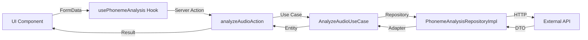

# Phoneme Analysis Module

## 📋 Overview

This module provides phoneme analysis functionality for speech recognition and pronunciation feedback. It follows Clean Architecture principles with clear separation of concerns.

## 🏗️ Architecture

### Layers

```
phoneme-analysis/
├── domain/               # Business logic (pure, no dependencies)
│   ├── entities/        # Core data structures
│   ├── repositories/    # Repository interfaces
│   └── use-cases/       # Business rules
├── infrastructure/      # External implementations
│   ├── adapters/        # DTO to Entity conversion
│   ├── dtos/           # Data Transfer Objects with Zod validation
│   └── repositories/   # API implementations
└── ui/                 # Presentation layer
    ├── actions/        # Server Actions (PREFERRED)
    ├── components/     # React components
    └── hooks/          # Custom hooks
```

## 🚀 Usage

### Using Server Actions (Recommended)

Server Actions are the **preferred** way to handle mutations in this application:

```tsx
'use client';

import { usePhonemeAnalysis } from '@/modules/phoneme-analysis/ui/hooks/use-phoneme-analysis';

export function MyComponent() {
  const { analyzeAudio, isLoading, error, result } = usePhonemeAnalysis();

  const handleAnalyze = (audioBlob: Blob) => {
    const formData = new FormData();
    formData.append('audio', new File([audioBlob], 'recording.webm'));
    formData.append('targetLanguage', 'en');
    formData.append('analysisType', 'pronunciation');
    
    analyzeAudio(formData);
  };

  return (
    <div>
      {isLoading && <p>Analyzing...</p>}
      {error && <p>Error: {error._form?.[0]}</p>}
      {result && <p>Accuracy: {result.accuracy}%</p>}
    </div>
  );
}
```

### Server Action Flow



## 🔧 Configuration

The module uses configuration from `core/config/api.config.ts`:

```typescript
export const phoneAnalysisApiConfig = {
  baseURL: process.env.PHONEME_ANALYSIS_API_URL || 'http://localhost:5005',
  timeout: 15000,
  retryAttempts: 2,
  endpoints: {
    analyze: '/api/PhonemeRecognition/analyze-v',
    compare: '/compare',
    feedback: '/feedback'
  }
};
```

### Environment Variables

```env
PHONEME_ANALYSIS_API_URL=http://localhost:5005
```

## 📝 Server Actions

### `analyzeAudioAction`

Analyzes audio for phoneme recognition and pronunciation feedback.

**Parameters:**
- `prevState: AnalyzeAudioActionState` - Previous state (for form state management)
- `formData: FormData` - Form data containing:
  - `audio` (File) - Audio file to analyze (required)
  - `targetLanguage` (string) - Target language code (optional, default: 'en')
  - `analysisType` (enum) - Type of analysis: 'pronunciation' | 'vowel' | 'consonant' (optional, default: 'pronunciation')
  - `expectedText` (string) - Expected text for comparison (optional)

**Returns:**
```typescript
{
  success?: boolean;
  errors?: {
    audio?: string[];
    targetLanguage?: string[];
    analysisType?: string[];
    _form?: string[];
  };
  result?: {
    analysisId: string;
    accuracy: number;
    phonemeCount: number;
    feedback: Array<{
      type: string;
      message: string;
      severity: number;
    }>;
  };
}
```

**Example:**
```typescript
const formData = new FormData();
formData.append('audio', audioFile);
formData.append('targetLanguage', 'en');
formData.append('analysisType', 'pronunciation');

const result = await analyzeAudioAction({}, formData);

if (result.success) {
  console.log('Analysis completed:', result.result);
} else {
  console.error('Errors:', result.errors);
}
```

## 🧪 Testing

### Using MSW (Mock Service Worker)

Mock handlers are configured in `mocks/handlers/phoneme-analysis.handlers.ts`:

```typescript
import { http, HttpResponse } from 'msw';

export const phonemeAnalysisHandlers = [
  http.post('http://localhost:5005/api/PhonemeRecognition/analyze-v', async ({ request }) => {
    const formData = await request.formData();
    const audioFile = formData.get('audioFile');
    
    return HttpResponse.json({
      analysis_id: 'mock_123',
      accuracy_score: 85.5,
      phonemes: [],
      feedback: [],
      created_at: new Date().toISOString()
    });
  }),
];
```

Enable mocks in development:
```env
USE_MOCKS=true
```

## 🔒 Security

- All mutations use **Server Actions** (server-side execution)
- Input validation with **Zod** schemas
- Correlation IDs for request tracing
- Structured logging for debugging
- No JWT tokens exposed to client

## ⚠️ Migration Notice

### Deprecated: API Routes

The following API endpoints are **deprecated** and will be removed in Q1 2026:

- ❌ `POST /api/phoneme-analysis` - Use `analyzeAudioAction` instead
- ❌ `POST /api/phoneme-analysis-alt` - Use `analyzeAudioAction` instead

**Why?**
According to the architecture guide (Section 4.5), API Routes should only be used for:
- Public webhooks
- External integrations
- Mobile app APIs

For web app mutations, Server Actions provide:
- ✅ Better TypeScript integration
- ✅ Native form handling
- ✅ Progressive enhancement
- ✅ Automatic error handling
- ✅ No need for manual fetch/axios

## 📊 Performance

- Audio file size limit: **10MB**
- Supported formats: MP3, WAV, OGG, M4A
- Average analysis time: 2-5 seconds
- Timeout: 15 seconds

## 🐛 Troubleshooting

### "Cannot connect to phoneme analysis API"

1. Ensure the external API is running:
   ```bash
   # Check if service is running on port 5005
   curl http://localhost:5005/api/health
   ```

2. Verify environment variables:
   ```env
   PHONEME_ANALYSIS_API_URL=http://localhost:5005
   ```

3. Check Docker/service logs for the external API

### "Invalid audio file format"

Supported formats:
- audio/mp3, audio/mpeg
- audio/wav
- audio/ogg
- audio/m4a, audio/x-m4a

### "Audio file too large"

Maximum file size is **10MB**. Consider:
- Using compression
- Reducing audio quality
- Trimming the recording

## 📚 Related Documentation

- [Architecture Guide](../../../documentation/GUIDE_ARCHITECTURE.md)
- [Design System](../../../documentation/DESIGN_SYSTEM.md)
- [API Configuration](../../core/config/api.config.ts)

## 🔄 Future Improvements

- [ ] Add batch audio analysis
- [ ] Support real-time streaming analysis
- [ ] Add caching layer for repeated analyses
- [ ] Implement retry logic with exponential backoff
- [ ] Add progress indicators for long analyses
- [ ] Support for more languages (currently EN only)
